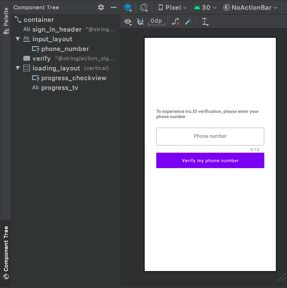
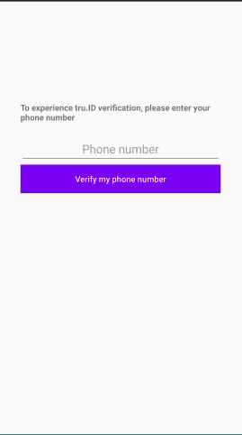
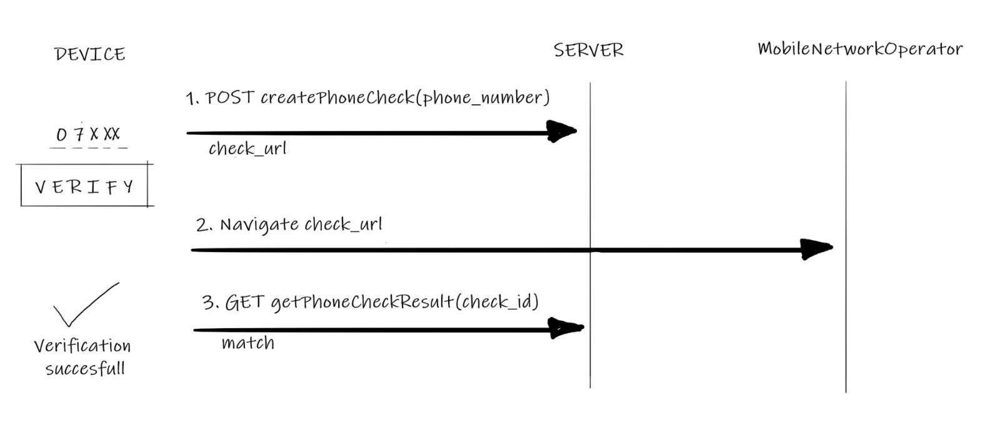
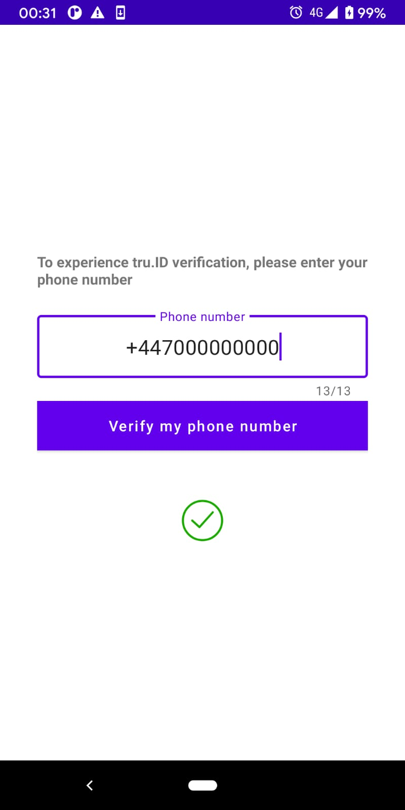

# How to Add SIM Card Based Mobile Authentication to your Android App [with tru.ID]

Validating user identity is incredibly important in mobile applications so developers need reliable ways to confirm the identities of their users. The most common approaches to this are social login or, as seen with apps such as WhatsApp, Telegram, Line, WeChat and many more, the mobile phone number. Using a mobile phone number as a unique identifier on a mobile application, verified via an SMS PIN code, makes logical sense. Unfortunately, there are [flaws with SMS-based verification](https://tru.id/blog/msisdn-vs-imsi-and-mobile-identity) that leave a user open to SIM Swap attacks.

The solution? SIM card based authentication which confirms the ownership of a mobile phone number by verifying the possession of an active SIM card with the same number and indicates when the SIM card associated with a phone number was last changed.

Along with adding crytographically secure phone verfication to an application and protecting the user from SIM swap attacks, SIM card based authentication also improves the user experience. No more one-time code exchange, custom logic to handle PIN mis-type or retries due to SMS delivery failure. The user never leaves the app and the entire verification happens seamlessly.

Fewer dependencies, better security and a better experience.

In this tutorial we'll cover how to add SIM card based phone authentication to and Android application using [**tru.ID SubscriberCheck**](https://tru.id/docs/subscriber-check).

**Estimated completion time: 20 mins**

The completed Android sample app in the [sim-card-auth-android repo](https://github.com/tru-ID/sim-card-auth-android) on GitHub. The repo includes a README with documentation for running and exploring the code.

Let's run through building this application step by step ...

## Before you Begin

To complete this tutorial you'll need an up to date version of [Android Studio]() installed, some basic knowledge of Kotlin programming and [Node.js]() installed. You'll also need a physical Android device with an active SIM card because SubscriberCheck verifies a phone number by making a web request over a mobile data session.

## Get Setup with **tru.ID**

Sign up for a [**tru.ID** account](https://tru.id/signup) which comes with some free credit. Then install the [**tru.ID** CLI](https://github.com/tru-ID/cli).

```bash
$ npm install -g @tru_id/cli@canary
```

Run `tru setup:credentials` using the credentials from the [**tru.ID** console](https://tru.id/console):

```bash
$ tru setup:credentials {client_id} {client_secret} {data_residency}
```

Install the [**tru.ID** development server]():

```bash
$ tru plugins:install @tru_id/dev-server@canary
```

Create a new **tru.ID** project:

```bash
$ tru projects:create AuthDemo
```

This will save a `tru.json` **tru.ID** project configuration to `./AuthDemo/tru.json`.

Run the development server, pointing it to the directly containing the newly created project configuration. This will also open up a localtunnel to your development server making it publicly accessible to the Internet so that your mobile phone can access it when only connected to mobile data.

```bash
$ tru server -t --project-dir ./AuthDemo
```

Open up the URL that is shown in the terminal, which will be in the format `https://{subdomain}.loca.lt`, in your desktop web browser to check that it is accessible.

With the development server setup we can move on to building the Android application.

## Creating a New Android Project

First, you have to create a new Android application using Android Studio. The app name is "SIMAuthentication". The package name is `id.tru.authentication.demo`.
Click through the wizard, ensuring that "Empty Activity" is selected. Leave the "Activity Name" set to `MainActivity`, and leave the "Layout Name" set to `activity_main`.

The `tru-sdk-android` is available on Android devices with minimum Android SDK Version 21 (Lollipop), therefore pick minSdkVersion = 21 once creating the project.

## Phone Number Authentication UI

The first screen will be our Verification screen on which the user has to enter their phone number. After adding their phone number, the user will click on a "Verify my phone number" button to initiate the verification worflow.

The user interface is straight forward: a ConstraintLayout with one TextInputEditText `phone_number` inside a TextInputLayout `input_layout` for phone number input and a `verify` Button, followed by a `loading_layout` where the user is updated on the progress, as we will see later on.



The main screen will look like this:



Bind the verification workflow to the verify button:

```kotlin
    binding.verify.setOnClickListener {
        initVerification()
     }
```

- Each time a verification is started we invalidate the UI, making sure all fields are reset, in order to cater for subsequent verification attempts:
```kotlin
    /** Called when the user taps the verify button */
    fun initVerification() {
        Log.d(TAG, "phoneNumber " + binding.phoneNumber.text)
        // close virtual keyboard when sign in starts
        binding.phoneNumber.onEditorAction(EditorInfo.IME_ACTION_DONE)

        if (Build.VERSION.SDK_INT >= Build.VERSION_CODES.O) {
            if (!isMobileDataConnectivityEnabled()) {
                startSettingsForResult.launch(CONNECTIVITY_SETTINGS_ACTION)
                return
            }
        }
        startVerification()
    }

    private fun startVerification() {
        invalidateUI()
        createSubscriberCheck()
    }
```

Now let's proceed to initiate a SubscriberCheck workflow, as described in the next section.

## SubscriberCheck Workflow

**TODO: update sequence diagram to use SubscriberCheck and use Mermaid.js**

The sequence diagram below shows the complete SubscriberCheck Workflow:




Create a `app/tru-id.properties` file and set the value of `EXAMPLE_SERVER_BASE_URL` to be the public URL of your development server:

```
EXAMPLE_SERVER_BASE_URL=https://{subdomain}.loca.lt
```

To perform network operations in your application such as making requests to the verification server, your `AndroidManifest.xml` must include the following permissions:

```xml
<uses-permission android:name="android.permission.INTERNET" />
<uses-permission android:name="android.permission.ACCESS_NETWORK_STATE" />
```

Both the Internet and `ACCESS_NETWORK_STATE` permissions are [normal permissions](https://developer.android.com/guide/topics/permissions/overview#normal-dangerous), which means they're granted at install time and don't need to be requested at runtime.

In order to communicate with our local server we will integrate Retrofit and relevant JSON converters:

```groovy
    implementation 'com.squareup.retrofit2:retrofit:2.9.0'
    implementation 'com.squareup.retrofit2:converter-gson:2.9.0'
```

### 1. Creating a SubscriberCheck

To start the phone number verification flow in an Android app, the user enters their phone number and either presses the done keyboard key or touch the "Verify my phone number" button. The application then sends the phone number to your verification server that will create a SubscriberCheck resource on the **tru.ID** platform.

In order to create a SubscriberCheck a `phone_number` is required, and once created, the SubscriberCheck will contain the `check_url` and the `check_id`.
Let's create these required models for our network operations in a new file `data/Model.kt`:

```kotlin
data class SubscriberCheckPost(
    @SerializedName("phone_number")
    val phone_number: String
)

data class SubscriberCheck(
    @SerializedName("check_url")
    val check_url: String,
    @SerializedName("check_id")
    val check_id: String
)
```

We create an `ApiService` interface in `api/ApiService.kt` that makes use of the models:

```kotlin
interface ApiService {

    @Headers("Content-Type: application/json")
    @POST("/check")
    suspend fun getSubscriberCheck(@Body user: SubscriberCheckPost): Response<SubscriberCheck>
}
```

Create a new file, `api/RetrofitBuilder.kt`, and within it create a Retrofit instance using `Retrofit.Builder`, passing the `ApiService` interface to generate an implementation. 
We are adding the `HttpLoggingInterceptor` just so we can check what is going on every step of the way.

```kotlin
object RetrofitBuilder {
    val apiClient: ApiService by lazy {

        val httpLoggingInterceptor = HttpLoggingInterceptor()
        httpLoggingInterceptor.setLevel(HttpLoggingInterceptor.Level.BODY);

        val okHttpClient = OkHttpClient()
            .newBuilder()
            //httpLogging interceptor for logging network requests
            .addInterceptor(httpLoggingInterceptor)
            .build()

        Retrofit.Builder()
            .baseUrl(BuildConfig.SERVER_BASE_URL)
            .client(okHttpClient)
            .addConverterFactory(GsonConverterFactory.create())
            .build()
            .create(ApiService::class.java)
    }
}
```
Note that the `BuildConfig.SERVER_BASE_URL` will be set with the value of `EXAMPLE_SERVER_BASE_URL` you defined in `tru-id.properties`.

Now we are ready to create the SubscriberCheck using the provided phone number:

```kotlin
    private fun createSubscriberCheck() {
        CoroutineScope(Dispatchers.IO).launch {
            val subscriberCheck = RetrofitBuilder.apiClient.getSubscriberCheck(SubscriberCheckPost(phone_number.text.toString()))
        }
    }
```

At this point we can update the UI, to let the user know the Phone Verification is in progress:

```kotlin
    withContext(Dispatchers.Main) {
        binding.progressTv.text = "Initiating Phone Verification ..."
    }
```

### 2. Using the **tru.ID** SDK to Request the SubscriberCheck URL

At this point you're going to add the `tru-sdk-android` SDK to your project to enable the SubscriberCheck URL to be requested over a mobile data connection.

Edit the `build.gradle` for your project at your project's root and add the following code snippet to the `allprojects/repositories` section:

```groovy
    maven {
        url "https://gitlab.com/api/v4/projects/22035475/packages/maven"
    }
 ```

Add the SDK dependency and don't forget to Sync the project.

```groovy
implementation 'id.tru.sdk:tru-sdk-android:0.0.1'
```

Create `api/RedirectManager.kt` to encapsulate obtaining a `TruSDK` instance and performing the network request with SubscriberCheck URL over the mobile data connection.

```kotlin
class RedirectManager {
    private val truSdk = TruSDK.getInstance()

    fun openCheckUrl(checkUrl: String) {
        truSdk.openCheckUrl(checkUrl)
    }
}
```

Update the `createSubscriberCheck` function to use the `RedirectManager` to request the SubscriberCheck URL from the previous step. This enables the mobile network operator and the **tru.ID** platform to identify the phone number associated with the mobile data session.

```kotlin
    private val redirectManager by lazy { RedirectManager() }

    private fun createSubscriberCheck() {
        CoroutineScope(Dispatchers.IO).launch {
            val subscriberCheck = RetrofitBuilder.apiClient.getSubscriberCheck(SubscriberCheckPost(phone_number.text.toString()))

            openCheckURL(subscriberCheck)
        }
    }

    private fun openCheckURL(check: SubscriberCheck) {
        CoroutineScope(Dispatchers.IO).launch {
            redirectManager.openCheckUrl(check.check_url)
        }
    }
```

### 3. Get the SubscriberCheck Results

Once the SubscriberCheck URL has been requested the **tru.ID** platform now knows the SubscriberCheck Match has been performed. Your mobile application and the application server should now query the result. This will in turn trigger the **tru.ID** platform to fetch the SubscriberCheck Match result from the MNO (Mobile Network Operator).

Add the SubscriberCheckResult model to `Model.kt`:

```kotlin
data class SubscriberCheckResult(
    @SerializedName("match")
    val match: Boolean,
    @SerializedName("check_id")
    val check_id: String
    @SerializedName("no_sim_change")
    val no_sim_change: Boolean
)
```

Add a `getSubscriberCheckResult` function to the `ApiService` interface:

```kotlin
interface ApiService {

    @Headers("Content-Type: application/json")
    @POST("/check")
    suspend fun getSubscriberCheck(@Body user: SubscriberCheckPost): Response<SubscriberCheck>

    @GET("/check_status")
    suspend fun getSubscriberCheckResult(@Query(value = "check_id") checkId: String): Response<SubscriberCheckResult>
}
```

Now it's time to execute the request and find out if the phone number was verified successfully. Create a new `getSubscriberCheckResult` function and call it after the `redirectManager.openCheckUrl` call has completed:


```kotlin
    private fun openCheckURL(check: SubscriberCheck) {
        CoroutineScope(Dispatchers.IO).launch {
            redirectManager.openCheckUrl(check.check_url)
        }

        getSubscriberCheckResult(check)
    }

    private fun getSubscriberCheckResult(check: SubscriberCheck) {
        CoroutineScope(Dispatchers.IO).launch {
            val subscriberCheckResult = RetrofitBuilder.apiClient.getSubscriberCheckResult(check.check_id)

            updateUI(subscriberCheckResult)
    }
```

There you go, based on the `subscriberCheckResult` you may notify the user that the authentication has completed, and probably jump on to the next screen.

```kotlin
    private suspend fun updateUI(subscriberCheckResult: SubscriberCheckResult) {
        withContext(Dispatchers.Main) {
            if (subscriberCheckResult.match && subscriberCheckResult.no_sim_change) {
                binding.progressCheckview.check()
                binding.progressTv.text = "Phone verification complete"
            } else {
                binding.progressTv.text = "Phone verification failed"
            }
        } 
    }
```
    
The value of `no_sim_change` indicates if the SIM card has not been changed in the last 7 days.
For example in the case of `match = true but no_sim_change = false` there is no confirmation that there have been no changes to this identity that may be suspect.



### Try Out SIM Card Based Authentication

Now that your code is complete, you can run the application on a real device. Bear in mind that SIM card based authentication is not be possible against an emulator.

Enter the phone number for the mobile device in the UI in the format +{country_code}{number} e.g. `+447900123456`
Press the done keyboard key or touch the "Verify my phone number" button.

**TODO: add video of app in action**

Congratulations! You've finished **SIM Card Based Mobile Authentication for Android** Tutorial.
You can continue to play with and adjust the code you've developed here, or check out the Next Steps below.


## Where next?

You can view a completed version of this sample app in the [sim-card-auth-android repo](https://github.com/tru-ID/sim-card-auth-android) on GitHub. This completed version adds code to validate phone number format with `libphonenumber`, and shows Internet Connectivity settings dialog prior to Login.

### Programmatically reading the device Phone Number, if you wish to leave the phone number input as part of app's responsibility

One option is to use [Play Services auth-api-phone library](https://developers.google.com/identity/sms-retriever/request#1_obtain_the_users_phone_number) hint picker that prompts the user to choose from the phone numbers stored on the device and thereby avoid having to manually type a phone number. 

**TODO: decide what to do with this part** 
What if my device supports multiple SIM cards?
Alternatively, if you just want to use platform features and no extra dependencies, Android 5.1 adds [support](https://developer.android.com/about/versions/android-5.1.html#multisim) for using more than one cellular carrier SIM card at a time. This feature lets users activate and use additional SIMs on devices that have two or more SIM card slots, but required READ_PHONE_STATE permission.

```kotlin
    @RequiresApi(Build.VERSION_CODES.M)
    fun readPhoneNumbers() {
        if (Build.VERSION.SDK_INT >= Build.VERSION_CODES.M) {
            val subscriptions =
                getSystemService(SubscriptionManager::class.java).activeSubscriptionInfoList

            for (item in subscriptions) {
                Log.d(TAG, "number " + item.number)
                Log.d(TAG, "network name " + item.carrierName)
                Log.d(TAG, "country iso " + item.countryIso)
            }
        }
    }
```


## Troubleshooting

Don't forget the SubscriberCheck validation requires the device to enable Mobile Data.
Because we have attached a *HttpLoggingInterceptor* you can use adb logs to debug your SubscriberCheck:

```code
I/okhttp.OkHttpClient: --> POST https://mylocalserver.example/check
I/okhttp.OkHttpClient: {"phone_number":"+447XXXXXXXXX"}
I/okhttp.OkHttpClient: --> END POST (32-byte body)
I/okhttp.OkHttpClient: <-- 200 https://mylocalserver.example/check (1479ms)
I/okhttp.OkHttpClient: {"check_id":"NEW_CHECK_ID","check_url":"https://eu.api.tru.id/phone_check/v0.1/checks/NEW_CHECK_ID/redirect"}
I/okhttp.OkHttpClient: <-- END HTTP (157-byte body)

D/RedirectManager: Triggering open check url https://eu.api.tru.id/phone_check/v0.1/checks/NEW_CHECK_ID/redirect
I/SDK::checkUrl: Triggering check url
I/System.out: Response to https://eu.api.tru.id/phone_check/v0.1/checks/NEW_CHECK_ID/redirect
D/LoginActivity: redirect done [7961ms]
I/okhttp.OkHttpClient: --> GET https://mylocalserver.example/check_status?check_id=NEW_CHECK_ID
I/okhttp.OkHttpClient: --> END GET
I/okhttp.OkHttpClient: <-- 200 https://mylocalserver.example/check_status?check_id=NEW_CHECK_ID (749ms)
I/okhttp.OkHttpClient: {"match":true,"check_id":"NEW_CHECK_ID"}
I/okhttp.OkHttpClient: <-- END HTTP (64-byte body)
```


 