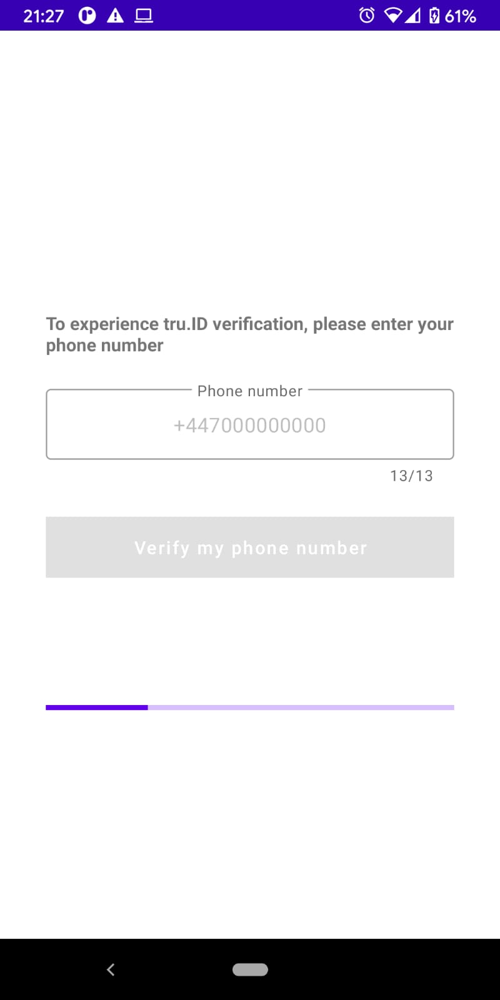
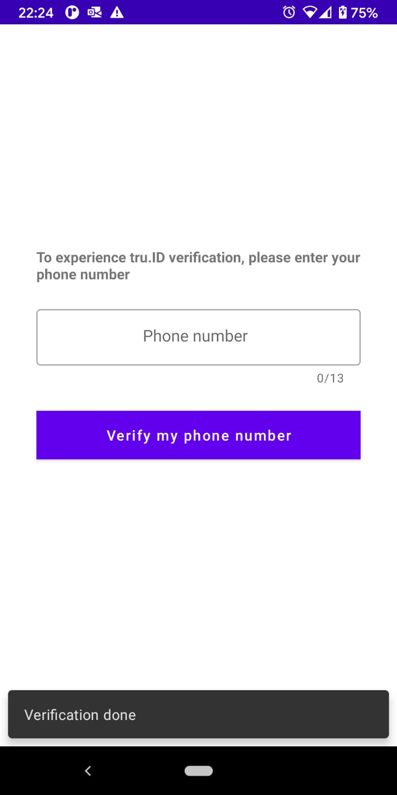
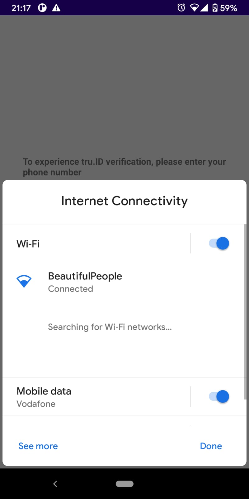

# How to Add SIM Card Based Mobile Authentication to your Android App [with tru.ID]

**TODO: update all images to match tutorial**

Validating user identity is incredibly important in mobile applications. The most common approaches to this are social login or, as seen with apps such as WhatsApp, Telegram, Line, WeChat and many more, the mobile phone number. Using a mobile phone number as a unique identifier on a mobile application, verified via an SMS PIN code, makes logical sense. Unfortunately, there are [flaws with SMS-based verification](https://tru.id/blog/msisdn-vs-imsi-and-mobile-identity) that result in poor UX due to waiting for SMS delivery, requesting retries following failed delivery and leave users open to SIM Swap attacks.

The solution? SIM card based authentication to confirm the ownership of a mobile phone number by verifying the possession of an active SIM card with the same number. It also indicates when the SIM card associated with a phone number was last changed as a signal for SIM swap detection.

Along with adding crytographically secure phone verfication to an application and protecting the user from SIM swap attacks, SIM card based authentication improves the user experience. No more one-time code exchange, custom logic to handle PIN mis-type or retries due to SMS delivery failure. The user never leaves the app and the entire verification happens seamlessly.

Fewer dependencies, better security and a better experience.

In this tutorial we'll cover how to add SIM card based phone authentication to and Android application using [**tru.ID SubscriberCheck**](https://developer.tru.id/docs/subscriber-check).

**TODO: move this into frontmatter**
**Estimated completion time: 20 mins**

The completed Android sample app in the [sim-card-auth-android repo](https://github.com/tru-ID/sim-card-auth-android) on GitHub. The repo includes a README with documentation for running and exploring the code.

Let's run through building this application step by step.

## Before you Begin

To complete this tutorial you'll need an up to date version of [Android Studio](https://developer.android.com/studio) installed, some basic knowledge of Kotlin programming and [Node.js](https://nodejs.org/en/download/) installed. You'll also need a physical Android device with an active SIM card because SubscriberCheck verifies a phone number by making a web request over a mobile data session.

## Get Setup with **tru.ID**

Sign up for a [**tru.ID** account](https://developer.tru.id/signup) which comes with some free credit. Then install the [**tru.ID** CLI](https://github.com/tru-ID/cli):

```bash
$ npm install -g @tru_id/cli
```

Run `tru setup:credentials` using the credentials from the [**tru.ID** console](https://developer.tru.id/console):

```bash
$ tru setup:credentials {client_id} {client_secret} {data_residency}
```

Install the CLI [development server plugin](https://github.com/tru-ID/cli-plugin-dev-server):

```bash
$ tru plugins:install @tru_id/cli-plugin-dev-server@canary
```

Create a new **tru.ID** project:

```bash
$ tru projects:create AuthDemo
```

This will save a `tru.json` **tru.ID** project configuration to `./authdemo/tru.json`.

Run the development server, pointing it to the directly containing the newly created project configuration. This will also open up a localtunnel to your development server making it publicly accessible to the Internet so that your mobile phone can access it when only connected to mobile data.

```bash
$ tru server -t --project-dir ./authdemo
```

Open up the URL that is shown in the terminal, which will be in the format `https://{subdomain}.loca.lt`, in your desktop web browser to check that it is accessible.

With the development server setup we can move on to building the Android application.

## Creating a New Android Project

First, you have to create a new Android application using Android Studio. The app name is "SIMAuthentication". The package name is `id.tru.authentication.demo`.
Click through the wizard, ensuring that "Empty Activity" is selected. Leave the "Activity Name" set to `MainActivity`, and leave the "Layout Name" set to `activity_main`.

The [`tru-sdk-android`](https://github.com/tru-ID/tru-sdk-android) is available on Android devices with minimum Android SDK Version 21 (Lollipop), therefore select minSdkVersion = 21 once creating the project.

## Phone Number Authentication UI

The first screen will be our Verification screen on which the user has to enter their phone number. After adding their phone number, the user will click on a "Verify my phone number" button to initiate the verification worflow.

The user interface is straight forward: a `ConstraintLayout` with one `TextInputEditText` `phone_number` inside a `TextInputLayout` `input_layout` for phone number input and a Button to trigger the verification, followed by a `progress_bar` where the user is updated on the progress, as we will see later on. Update `activity_main.xml` with the following:

**TODO: make expandable in the tutorial**

```xml
<?xml version="1.0" encoding="utf-8"?>
<androidx.constraintlayout.widget.ConstraintLayout xmlns:android="http://schemas.android.com/apk/res/android"
    xmlns:app="http://schemas.android.com/apk/res-auto"
    xmlns:tools="http://schemas.android.com/tools"
    android:id="@+id/container"
    android:layout_width="match_parent"
    android:layout_height="match_parent"
    tools:context=".MainActivity"
    android:paddingLeft="36dp"
    android:paddingTop="220dp"
    android:paddingRight="36dp">

    <TextView
        android:id="@+id/sign_in_header"
        android:layout_width="match_parent"
        android:layout_height="wrap_content"
        android:text="To experience tru.ID verification, please enter your phone number"
        android:textStyle="bold"
        app:layout_constraintEnd_toEndOf="parent"
        app:layout_constraintStart_toStartOf="parent"
        app:layout_constraintTop_toTopOf="parent" />

    <com.google.android.material.textfield.TextInputLayout
        android:id="@+id/input_layout"
        android:layout_width="match_parent"
        android:layout_height="wrap_content"
        app:errorEnabled="true"
        app:counterEnabled="true"
        app:counterMaxLength="13"
        android:layout_marginTop="20dp"
        style="@style/Widget.MaterialComponents.TextInputLayout.OutlinedBox"
        app:layout_constraintEnd_toEndOf="parent"
        app:layout_constraintStart_toStartOf="parent"
        app:layout_constraintTop_toBottomOf="@+id/sign_in_header">

        <com.google.android.material.textfield.TextInputEditText
            android:id="@+id/phone_number"
            android:layout_width="match_parent"
            android:layout_height="wrap_content"
            android:gravity="top|center"
            android:hint="Phone number"
            android:inputType="phone"
            android:imeOptions="actionDone"
            app:layout_constraintEnd_toEndOf="parent"
            app:layout_constraintStart_toStartOf="parent"
            app:layout_constraintTop_toBottomOf="@+id/textView" />
    </com.google.android.material.textfield.TextInputLayout>

    <Button
        android:id="@+id/verify"
        android:layout_width="match_parent"
        android:layout_height="wrap_content"
        android:layout_gravity="center"
        android:layout_marginTop="20dp"
        android:background="#6200EE"
        android:text="Verify my phone number"
        android:textAllCaps="false"
        android:textColor="@android:color/white"
        android:enabled="false"
        app:layout_constraintBottom_toBottomOf="@+id/input_layout"
        app:layout_constraintEnd_toEndOf="parent"
        app:layout_constraintStart_toStartOf="parent"
        app:layout_constraintTop_toTopOf="@+id/progress_bar"
        app:layout_constraintVertical_bias="0.698" />

    <com.google.android.material.progressindicator.LinearProgressIndicator
        android:id="@+id/progress_bar"
        android:layout_width="match_parent"
        android:layout_height="wrap_content"
        android:indeterminate="true"
        android:visibility="invisible"
        android:layout_marginTop="100dp"
        app:layout_constraintEnd_toEndOf="parent"
        app:layout_constraintStart_toStartOf="parent"
        app:layout_constraintTop_toBottomOf="@+id/verify"/>

</androidx.constraintlayout.widget.ConstraintLayout>
```

**TODO: either remove or provide specific versions**

Make sure to update the dependencies for `ConstraintLayout` and Material Components with the latest available versions with `app/build.gradle`:

```groovy
implementation 'com.google.android.material:material:1.3.0'
implementation 'androidx.constraintlayout:constraintlayout:2.0.4'
```

The main screen will look like this:


To enable view binding that allows you to more easily write code that interacts with views set the `viewBinding` build option to `true` in the `app/build.gradle` file and :

```
android {
    buildFeatures {
        viewBinding true
    }
}
```

Bind the verification workflow to the verify button within `app/src/main/java/id/tru/authentication/demo/MainActivity.kt`: 

```kotlin
class MainActivity : AppCompatActivity() {

    private var _binding: ActivityMainBinding? = null
    private val binding get() = _binding!!

    override fun onCreate(savedInstanceState: Bundle?) {
        super.onCreate(savedInstanceState)

        _binding = ActivityMainBinding.inflate(layoutInflater)
        setContentView(binding.root)

        binding.verify.setOnClickListener {
            initVerification()
        }
    }

    override fun onDestroy() {
        super.onDestroy()
        _binding = null
    }

    private fun initVerification() {
        Log.d(TAG, "Verify button clicked")
    }

    companion object {
        private const val TAG = "MainActivity"
    }
}
```

Each time a verification is started we invalidate the UI, making sure all fields are reset, in order to cater for subsequent verification attempts:

```kotlin
    /** Called when the user taps the verify button */
    private fun initVerification() {
        Log.d(TAG, "phoneNumber " + binding.phoneNumber.text)
        // close virtual keyboard when sign in starts
        binding.phoneNumber.onEditorAction(EditorInfo.IME_ACTION_DONE)

        invalidateVerificationUI(false)
    }

    private fun invalidateVerificationUI(isEnabled: Boolean) {
        if (isEnabled) {
            binding.progressBar.hide()
            binding.phoneNumber.setText("")
        } else {
            binding.progressBar.show()
        }
        binding.verify.isEnabled = isEnabled
        binding.phoneNumber.isEnabled = isEnabled
    }
```



Now, let's proceed to initiate a SubscriberCheck workflow, as described in the next section.

## SubscriberCheck Workflow

**TODO: update sequence diagram to use SubscriberCheck and use Mermaid.js**

The sequence diagram below shows the complete SubscriberCheck Workflow:


Create a `app/tru-id.properties` file and set the value of `EXAMPLE_SERVER_BASE_URL` to be the public URL of your development server:

```
EXAMPLE_SERVER_BASE_URL="https://{subdomain}.loca.lt"
```

To perform network operations in your application such as making requests to the verification server, your `AndroidManifest.xml` must include `android.permission.INTERNET` and `android.permission.ACCESS_NETWORK_STATE` permissions. Also, some mobile network operator check requests are over HTTP (and not HTTPS) the application must also allow [cleartext network traffic](https://developer.android.com/guide/topics/manifest/application-element#usesCleartextTraffic). Note that no data is sent over the HTTP request. The request is used by the MNO to verify that the device is connected to their mobile data network.

Your `AndroidManifest.xml` will look as follows:

```xml
<?xml version="1.0" encoding="utf-8"?>
<manifest xmlns:android="http://schemas.android.com/apk/res/android"
    package="id.tru.authentication.demo">

    <uses-permission android:name="android.permission.INTERNET" />
    <uses-permission android:name="android.permission.ACCESS_NETWORK_STATE" />

    <application
        android:usesCleartextTraffic="true"
        android:allowBackup="true"
        android:icon="@mipmap/ic_launcher"
        android:label="@string/app_name"
        android:roundIcon="@mipmap/ic_launcher_round"
        android:supportsRtl="true"
        android:theme="@style/Theme.MaterialComponents.Light.NoActionBar">

        <activity android:name=".MainActivity">
            <intent-filter>
                <action android:name="android.intent.action.MAIN" />

                <category android:name="android.intent.category.LAUNCHER" />
            </intent-filter>
        </activity>
    </application>

</manifest>
```

Both the Internet and `ACCESS_NETWORK_STATE` permissions are [normal permissions](https://developer.android.com/guide/topics/permissions/overview#normal-dangerous), which means they're granted at install time and don't need to be requested at runtime.

In order to communicate with our local server the app needs to read in the `app/tru-id.properties` file containing the server URL and set a build configuration field. We want to include Retrofit, relevant JSON converters and OkHttp. Finally, include kotlinx-coroutine:

Update `app/build.gradle` with the following additions:

```groovy
def props = new Properties()
file("tru-id.properties").withInputStream { props.load(it) }

android {
    defaultConfig {
        buildConfigField("String", "SERVER_BASE_URL", props.getProperty("EXAMPLE_SERVER_BASE_URL"))
    }

    dependencies {
        implementation 'com.squareup.retrofit2:retrofit:2.9.0'
        implementation 'com.squareup.retrofit2:converter-gson:2.9.0'
        implementation 'com.squareup.okhttp3:okhttp:4.9.0'
        implementation 'com.squareup.okhttp3:logging-interceptor:4.9.0'
        implementation 'org.jetbrains.kotlinx:kotlinx-coroutines-core:1.3.7'
        implementation 'org.jetbrains.kotlinx:kotlinx-coroutines-android:1.3.0'
    }
}
```

### 1. Create a SubscriberCheck

To start the phone number verification flow in an Android app, the user enters their phone number and either presses the done keyboard key or touch the "Verify my phone number" button. The application then sends the phone number to your verification server that will create a SubscriberCheck resource on the **tru.ID** platform.

So, in order to create a SubscriberCheck a `phone_number` is required, and once created, the SubscriberCheck will contain a `check_url` and a `check_id`.

Let's create these required models for our network operations in a new file `data/Model.kt`:

```kotlin
data class SubscriberCheckPost(
    @SerializedName("phone_number")
    val phone_number: String
)

data class SubscriberCheck(
    @SerializedName("check_url")
    val check_url: String,
    @SerializedName("check_id")
    val check_id: String
)
```

Next, create an `ApiService` interface in `api/ApiService.kt` that makes use of the models, making a `POST` request to the `/subscriber-check` endpoint on the development server:

```kotlin
interface ApiService {
    @Headers("Content-Type: application/json")
    @POST("/subscriber-check")
    suspend fun createSubscriberCheck(@Body user: SubscriberCheckPost): Response<SubscriberCheck>
}
```

Create a new file, `api/RetrofitBuilder.kt`, and within it create a Retrofit instance using `Retrofit.Builder`, passing the `ApiService` interface to generate an implementation.

We are also adding the `HttpLoggingInterceptor` so we can check what is going on every step of the way.

```kotlin
object RetrofitBuilder {
    val apiClient: ApiService by lazy {

        val httpLoggingInterceptor = HttpLoggingInterceptor()
        httpLoggingInterceptor.setLevel(HttpLoggingInterceptor.Level.BODY);

        val okHttpClient = OkHttpClient()
            .newBuilder()
            //httpLogging interceptor for logging network requests
            .addInterceptor(httpLoggingInterceptor)
            .build()

        Retrofit.Builder()
            .baseUrl(BuildConfig.SERVER_BASE_URL)
            .client(okHttpClient)
            .addConverterFactory(GsonConverterFactory.create())
            .build()
            .create(ApiService::class.java)
    }
}
```
Note that the `BuildConfig.SERVER_BASE_URL` will be set with the value of `EXAMPLE_SERVER_BASE_URL` you defined in `tru-id.properties`.

Now we are ready to inform the user the verification process has started and create the SubscriberCheck using the provided phone number within `MainActivity.kt`:

```kotlin
    /** Called when the user taps the verify button */
    private fun initVerification() {
        Log.d(TAG, "phoneNumber " + binding.phoneNumber.text)
        // close virtual keyboard when sign in starts
        binding.phoneNumber.onEditorAction(EditorInfo.IME_ACTION_DONE)

        invalidateVerificationUI(false)
        createSubscriberCheck()
    }
    
    private fun createSubscriberCheck() {
        CoroutineScope(Dispatchers.IO).launch {

            val subscriberCheck = RetrofitBuilder.apiClient.createSubscriberCheck(
                SubscriberCheckPost(binding.phoneNumber.text.toString())
            )
        }
    }
```

### 2. Use the **tru.ID** SDK to Request the SubscriberCheck URL

At this point you're going to add the `tru-sdk-android` SDK to your project to enable the SubscriberCheck URL to be requested over a mobile data connection.

Edit the `build.gradle` at your project's root and add the following code snippet to the `allprojects/repositories` section:


```groovy
allprojects {
    repositories {
        google()
        jcenter()
        maven {
            url "https://gitlab.com/api/v4/projects/22035475/packages/maven"
        }
        maven { url 'https://jitpack.io' }
    }
}
 ```

Add the SDK dependency to `app/build.gradle` and sync the project.

```groovy
implementation 'id.tru.sdk:tru-sdk-android:0.0.+'
```

Initialize the `TruSDK` within `onCreate` in `MainActivity.kt`:

```kotlin
override fun onCreate(savedInstanceState: Bundle?) {
    super.onCreate(savedInstanceState)

    TruSDK.initializeSdk(applicationContext)

    _binding = ActivityMainBinding.inflate(layoutInflater)
    setContentView(binding.root)
    
    binding.verify.setOnClickListener {
        initVerification()
    }
}
```

Create `api/RedirectManager.kt` to encapsulate obtaining a `TruSDK` instance and performing the network request with SubscriberCheck URL over the mobile data connection.

```kotlin
class RedirectManager {
    private val truSdk = TruSDK.getInstance()

    fun openCheckUrl(checkUrl: String) {
        truSdk.openCheckUrl(checkUrl)
    }
}
```

Update the `createSubscriberCheck` function in `MainActivity.kt` to use the `RedirectManager` to request the SubscriberCheck URL from the previous step. This enables the mobile network operator and the **tru.ID** platform to verify the phone number is associated with the mobile data session.

```kotlin
    private val redirectManager by lazy { RedirectManager() }

    private fun createSubscriberCheck() {
        CoroutineScope(Dispatchers.IO).launch {
            val response = RetrofitBuilder.apiClient.createSubscriberCheck(
                SubscriberCheckPost(binding.phoneNumber.text.toString())
            )

            if (response.isSuccessful && response.body() != null) {
                val subscriberCheck = response.body() as SubscriberCheck
                openCheckURL(subscriberCheck)
            }
            else {
                updateUIonError("Error Occurred: ${response.message()}")
            }
        }
    }

    private fun openCheckURL(check: SubscriberCheck) {
        CoroutineScope(Dispatchers.IO).launch {
            redirectManager.openCheckUrl(check.check_url)
        }
    }

    private suspend fun updateUIonError(additionalInfo: String) {
        Log.e(TAG, additionalInfo)
        withContext(Dispatchers.Main) {
            invalidateVerificationUI(true)
        }
    }
```

### 3. Get the SubscriberCheck Results

Once the SubscriberCheck URL has been requested the **tru.ID** platform now knows the check request has been performed. Your mobile application should query the result via your server application. This will in turn trigger the **tru.ID** platform to fetch the SubscriberCheck match result from the MNO (Mobile Network Operator).

Add the SubscriberCheckResult model to `Model.kt`:

```kotlin
data class SubscriberCheckResult(
    @SerializedName("match")
    val match: Boolean,
    @SerializedName("check_id")
    val check_id: String,
    @SerializedName("no_sim_change")
    val no_sim_change: Boolean
)
```

Add a `getSubscriberCheckResult` function to the `ApiService` interface:

```kotlin
interface ApiService {
    @Headers("Content-Type: application/json")
    @POST("/subscriber-check")
    suspend fun createSubscriberCheck(@Body user: SubscriberCheckPost): Response<SubscriberCheck>

    @GET("/subscriber-check/{check_id}")
    suspend fun getSubscriberCheckResult(@Path("check_id") checkId: String): Response<SubscriberCheckResult>
}
```

Now it's time to find out if the phone number was verified successfully. Create a new `getSubscriberCheckResult` function in `MainActivity.kt` and call it after the `redirectManager.openCheckUrl`. The call to `getSubscriberCheckResult` must be done within the coroutine to ensure the check URL request has completed.


```kotlin
    private fun openCheckURL(check: SubscriberCheck) {
        CoroutineScope(Dispatchers.IO).launch {
            redirectManager.openCheckUrl(check.check_url)

            getSubscriberCheckResult(check)
        }
    }

    private fun getSubscriberCheckResult(check: SubscriberCheck) {
        CoroutineScope(Dispatchers.IO).launch {
            val response = RetrofitBuilder.apiClient.getSubscriberCheckResult(check.check_id)
            if(response.isSuccessful && response.body() != null) {
                val subscriberCheckResult = response.body() as SubscriberCheckResult
                
                updateUI(subscriberCheckResult)
            }
        }
    }

    private suspend fun updateUI(subscriberCheckResult: SubscriberCheckResult) {
        Log.d(TAG, "TODO: update the UI")
    }
```

There you go, based on the `subscriberCheckResult` you may notify the user that the authentication has completed.

```kotlin
    private suspend fun updateUI(subscriberCheckResult: SubscriberCheckResult) {
        withContext(Dispatchers.Main) {
            if (subscriberCheckResult.match && subscriberCheckResult.no_sim_change) {
                Snackbar.make(binding.container, "Phone verification complete", Snackbar.LENGTH_LONG).show()
            } else {
                Snackbar.make(binding.container, "Phone verification failed", Snackbar.LENGTH_LONG).show()
            }

            invalidateVerificationUI(true)
        }
    }
```
    
The value of `no_sim_change` indicates if the SIM card has not been changed in the last 7 days. For example, in the case of `match = true` but `no_sim_change = false` the phone number has been verified but the fact the SIM card has changed recently means that it's good practice to perform additional user checks before allowing them to register or login.



In an application that contains more than a login or signup activity you would now show either a screen to capture more user information or the successfully registered/logged-in screen.

### Try Out SIM Card Based Authentication

Now that your code is complete, you can run the application on a real device. Bear in mind that SIM card based authentication is not be possible against an emulator.

Enter the phone number for the mobile device in the UI in the format +{country_code}{number} e.g. `+447900123456`.

Touch the "Verify my phone number" button.


Congratulations! You've finished the **SIM Card Based Mobile Authentication for Android** Tutorial.

## Where next?

You can view a completed version of this sample app in the [sim-card-auth-android repo](https://github.com/tru-ID/sim-card-auth-android) on GitHub.

### Optional step: Client side phone number pre-validation

The minimum phone number pre-validation that can be achieved on the client side is to validate the phone number format with `libphonenumber`.

Update `app/build.gradle` to include this library:

```groovy
implementation 'com.googlecode.libphonenumber:libphonenumber:8.12.10'
```

And create a `util/PhoneNumberUtil.kt` utility that validates the phone number format +{country_code}{number} e.g. `+447900123456`

```kotlin
fun isPhoneNumberFormatValid(phoneNumber: String): Boolean {
    val phoneNumberUtil = PhoneNumberUtil.getInstance()
    return try {
        phoneNumberUtil.isValidNumber(phoneNumberUtil.parse(
                phoneNumber, Phonenumber.PhoneNumber.CountryCodeSource.UNSPECIFIED.name))
    } catch (e: NumberParseException) {
        false
    }
}
```

Now invoke the phone number pre-validation on `createSubscriberCheck`:

```kotlin
private fun createSubscriberCheck() {
    if (!isPhoneNumberFormatValid(binding.phoneNumber.text.toString())) {
        invalidateVerificationUI(true)
        Snackbar.make(binding.container, "Phone number invalid", Snackbar.LENGTH_LONG).show()
        return
    }
 ```

### Optional step: check if mobile data is enabled at runtime

The SubscriberCheck validation requires the device to have mobile data enabled. We can programmatically check if this is the case and launch Internet Connectivity settings dialog if required.

Firstly, add a utility method `isMobileDataEnabled` to your `MainActivity.kt` to check if the mobile data is enabled:

```kotlin
    @RequiresApi(Build.VERSION_CODES.O)
    private fun isMobileDataEnabled(): Boolean {
        val tm = getSystemService(TELEPHONY_SERVICE) as TelephonyManager
        return tm.isDataEnabled
    }
```

The Activity Result APIs provide components for registering for a result, launching the result, and handling the result once it is dispatched by the system.

To get started, add the dependencies:

```groovy
implementation 'androidx.activity:activity-ktx:1.2.0'
implementation 'androidx.fragment:fragment-ktx:1.3.0'
```

The next step is to create a custom result contract `data/ConnectivitySettingsContract.kt`, this class would extend ActivityResultContract<I,O> which requires defining input and output classes.

```kotlin
class ConnectivitySettingsContract : ActivityResultContract<Int, Uri?>() {
    @RequiresApi(Build.VERSION_CODES.Q)
    override fun createIntent(context: Context, input: Int) = Intent(Settings.Panel.ACTION_INTERNET_CONNECTIVITY)

    override fun parseResult(resultCode: Int, result: Intent?): Uri? {
        println("Result code $resultCode")

        if (resultCode != Activity.RESULT_OK) {
            return null
        }

        return result?.data
    }
}
```

Next, we register a callback for an activity result, we do that by defining `registerForActivityResult()` which takes the `ConnectivitySettingsContract` and `ActivityResultCallback` and returns an `ActivityResultLauncher` which is used to launch the other activity:

```kotlin
    private val startSettingsForResult = registerForActivityResult(ConnectivitySettingsContract()) {
        Log.i(TAG, "Internet Connectivity Setting dismissed")
        initVerification()
    }
```

If the mobile data is disabled we launch the previously created `ActivityResultLauncher`, as follows:

```kotlin
    private fun initVerification() {
        Log.d(TAG, "phoneNumber " + binding.phoneNumber.text)
        // close virtual keyboard when sign in starts
        binding.phoneNumber.onEditorAction(EditorInfo.IME_ACTION_DONE)

        if (Build.VERSION.SDK_INT >= Build.VERSION_CODES.O) {
            if (!isMobileDataEnabled()) {
                startSettingsForResult.launch(CONNECTIVITY_SETTINGS_ACTION)
                return
            }
        }
        startVerification()
    }

    companion object {
        private const val TAG = "MainActivity"
        const val CONNECTIVITY_SETTINGS_ACTION = 1
    }
```



### Programmatically reading the device Phone Number

If you're trying to create a even more magical phone number verification experience you can make the phone number input part of app's responsibility

One option is to use [Play Services auth-api-phone library](https://developers.google.com/identity/sms-retriever/request#1_obtain_the_users_phone_number) hint picker that prompts the user to choose from the phone numbers stored on the device and thereby avoid having to manually type a phone number. 


## Troubleshooting


### Mobile Data is Required

Don't forget the SubscriberCheck validation requires the device to enable mobile data.

### Check the HTTP Logging Output

Because we have attached a *HttpLoggingInterceptor* you can use adb logs to debug your SubscriberCheck:

```code
I/okhttp.OkHttpClient: --> POST https://mylocalserver.example/subscriber-check
I/okhttp.OkHttpClient: {"phone_number":"+447XXXXXXXXX"}
I/okhttp.OkHttpClient: --> END POST (32-byte body)
I/okhttp.OkHttpClient: <-- 200 https://mylocalserver.example/check (1479ms)
I/okhttp.OkHttpClient: {"check_id":"NEW_CHECK_ID","check_url":"https://eu.api.tru.id/subscriber_check/v0.1/checks/NEW_CHECK_ID/redirect"}
I/okhttp.OkHttpClient: <-- END HTTP (157-byte body)

D/RedirectManager: Triggering open check url https://eu.api.tru.id/subscriber_check/v0.1/checks/NEW_CHECK_ID/redirect
I/SDK::checkUrl: Triggering check url
I/System.out: Response to https://eu.api.tru.id/subscriber_check/v0.1/checks/NEW_CHECK_ID/redirect
D/LoginActivity: redirect done [7961ms]
I/okhttp.OkHttpClient: --> GET https://mylocalserver.example/subscriber-check/NEW_CHECK_ID
I/okhttp.OkHttpClient: --> END GET
I/okhttp.OkHttpClient: <-- 200 https://mylocalserver.example/subscriber-check/NEW_CHECK_ID (749ms)
I/okhttp.OkHttpClient: {"match":true,"check_id":"NEW_CHECK_ID","no_sim_change":true}
I/okhttp.OkHttpClient: <-- END HTTP (64-byte body)
```

### Check the Development Server Logging

The [development server]() also logs information out to the terminal including request and response payloads. Check that output for any errors or unexpected values.

### Get in touch

If you have any questions, get in touch via [help@tru.id](mailto:help@tru.id).